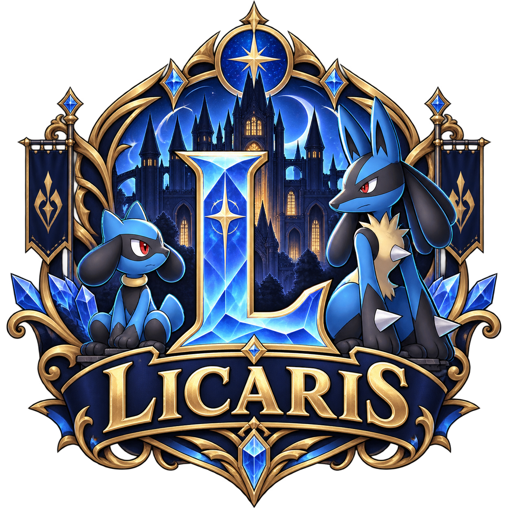
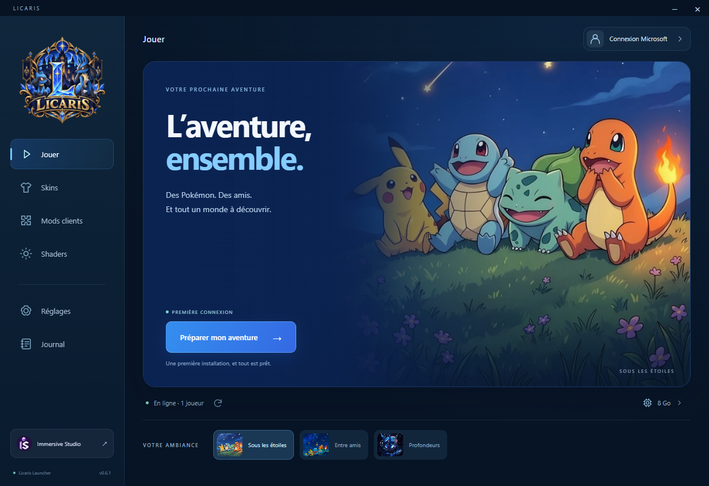

# Licaris Launcher

<p align="center"></p>



Launcher Windows pour votre aventure Cobblemon entre amis.

## Télécharger

Récupérez le Setup ou la version Portable dans les [releases du launcher](https://github.com/fraiyee14minecraft-dot/licaris/releases/latest).

- **Setup** : installe le launcher. À chaque ouverture, les mises à jour sont recherchées, téléchargées puis installées automatiquement, avec relance du launcher.
- **Portable** : fonctionne sans installation ; les nouvelles versions de l’exécutable se téléchargent manuellement.

Depuis la version 0.5.2, aucun bouton d’installation n’est nécessaire pour les mises à jour du launcher installé. Une progression apparaît au démarrage. Une partie ou une opération déjà en cours se termine avant l’installation ; en cas d’échec réseau, le launcher reste utilisable et réessaie à la prochaine ouverture.

Pour passer d’une version 0.5.1 ou antérieure à ce fonctionnement, utiliser une dernière fois son bouton **Installer la mise à jour du launcher**, ou ouvrir le nouveau Setup. Les mises à jour suivantes s’installeront automatiquement.

## Jouer

1. Ouvrir le launcher.
2. Choisir le compte Microsoft qui possède Minecraft Java Edition.
3. Installer le modpack, puis lancer le jeu.

Le launcher prépare Java, Minecraft et Fabric, puis vérifie le modpack avant chaque partie. Les fichiers inchangés réutilisent une empreinte récente et seules les ressources modifiées sont extraites. Le bouton **Vérifier les fichiers** force une nouvelle lecture complète.

## Votre launcher

- **Compte Microsoft** : choix du compte, déconnexion et avatar tiré du skin Minecraft.
- **Accueil** : trois ambiances Pokémon bleues au choix, mémorisées sur cet ordinateur.
- **Skins** : aperçu 3D, bibliothèque PNG locale, modèles classique et fin, application au compte Minecraft connecté.
- **Mods clients** : activation ou désactivation des options vérifiées. Les mods nécessaires au serveur et les dépendances restent protégés ; les choix prennent effet à la prochaine préparation.
- **Shaders** : huit choix avec aperçus et filtres Fluidité, Équilibré et Cinématique. Installation depuis Modrinth, sélection d’un shader local ou désactivation. Iris doit être activé. Le rendu et les performances dépendent du matériel et des réglages du jeu.
- **Réglages** : mémoire du jeu, maintien, réduction ou fermeture du launcher au démarrage de Minecraft.
- **Journal** : accès aux fichiers et copie d’un rapport avec masquage des adresses de connexion et jetons connus.

[Immersive Studio](https://immersive-studio.fr/) est accessible directement en bas de la navigation, avec son logo.

Les modifications de fichiers sont bloquées pendant une partie. Les options et skins de chaque joueur restent dans ses données locales.

## Modpack

Base : **Cobblemon Academy 2.0, version 2.6.0**, Minecraft **1.21.1**, Fabric **0.18.1**, Java **21**.

Les versions du modpack sont publiées séparément des versions du launcher. Les téléchargements sont vérifiés par SHA-256.

## Développement

Après clonage, copier `launcher-config.example.json` vers `launcher-config.json` et renseigner votre configuration dans cette copie locale, exclue de Git.

```sh
npm ci
npm test
npm start
```

Construction Windows : `npm run dist`.

Le catalogue `pack/client-options.json` associe les options clientes aux empreintes et dépendances des JAR vérifiés. Après un changement des mods dans le dossier local de publication, exécuter `npm run catalog:clients` (Python 3), relire les dépendances et publier une nouvelle version du launcher pour proposer les options du nouveau pack. Si le catalogue ne correspond plus au pack, la désactivation est suspendue et les mods requis sont rétablis lors de la préparation. Les préférences sont conservées.

L’aperçu utilise [skinview3d](https://github.com/bs-community/skinview3d) ; son bundle est produit par `npm run build`.

Les illustrations d’accueil ont été fournies pour Licaris et sont utilisées sans retouche. Les aperçus des shaders proviennent des galeries de leurs créateurs ; les pages et images sources figurent dans `ui/shaders/credits.json`. Le logo Licaris original est conservé dans le launcher et le Setup. Les icônes de navigation sont dessinées en SVG ; le logo Immersive Studio provient du projet du studio.

L’habillage du Setup se reconstruit avec Electron via `scripts/render-installer.cjs`, puis avec `python scripts/export-brand-icons.py` (Pillow requis) pour les formats BMP et ICO. Le Setup et les mises à jour conservent la même identité d’application et les données des joueurs.

Les accès d’administration, sessions de joueurs et configurations locales ne doivent pas être ajoutés au dépôt.
